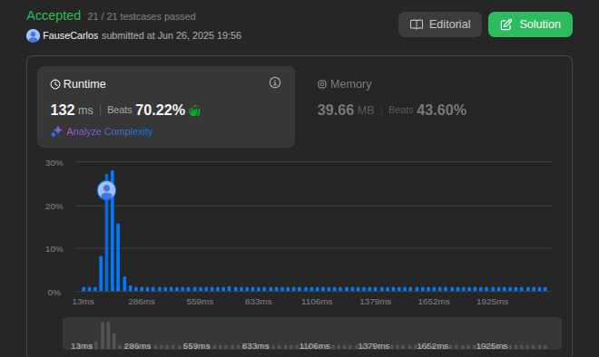

# DC_Questions

**Conteúdo da Disciplina**: Dividir e conquistar  

## Alunos
|Matrícula | Aluno |
| -- | -- |
| 21/1031691  |  Fause Carlos Mascarenhas Lustosa Junior |
| 19/0116072  |  Raphaela Guimarães de Araujo dos Santos |

## Sobre 

|Problema | Dificuldade |Vìdeo |
| -- | -- |-- |
| [295.Find_Median_from_Data_Stream](https://leetcode.com/problems/find-median-from-data-stream/description/) | Difícil| [clique aqui](https://youtu.be/TQmE9CJhcN8) |
| [218.The_Skyline_Problem](https://leetcode.com/problems/the-skyline-problem/submissions/1677719993/) | Difícil| [clique aqui](https://youtu.be/l_3NDVsGqf4) |
| [23. Merge k Sorted Lists](https://leetcode.com/problems/merge-k-sorted-lists/description) | Difícil | [clique aqui](https://youtu.be/jd1Ac0WEoPA) |
  [327. Count of Range Sum](https://leetcode.com/problems/count-of-range-sum/description) | Difícil | [clique aqui](https://youtu.be/_PlPpXm8OyA) |

## Screenshots
Screenshots do resultado das submissões das questões no leetcode.

Questão 218.The_Skyline_Problem

    

 

Questão 295.Find_Median_from_Data_Stream

    

Questão: 23. Merge k Sorted Lists

    

Questão: 327. Count of Range Sum

    

## Instalação 
**Linguagem**: Python 

