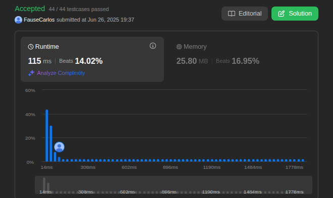

# DC_Questions

**Número da Lista**: X 
**Conteúdo da Disciplina**:  

## Alunos
|Matrícula | Aluno |
| -- | -- |
| 21/1031691  |  Fause Carlos Mascarenhas Lustosa Junior |
| 19/0116072  |  Raphaela Guimarães de Araujo dos Santos |

## Sobre 

|Problema | Dificuldade |Vìdeo |
| -- | -- |-- |
| [295.Find_Median_from_Data_Stream](https://leetcode.com/problems/find-median-from-data-stream/description/) |  Difícil|[clique aqui]() |
| [218.The_Skyline_Problem](https://leetcode.com/problems/the-skyline-problem/submissions/1677719993/) |  Difícil|[clique aqui]() |
| - |  Difícil|[clique aqui]- |

## Screenshots
Screenshots do resultado das submissões das questões no leetcode.

Questão: 1

Questão: 218.The_Skyline_Problem

    

 

Questão: 2

<!-- Questão:2931. maximum spending after buying items

    

 -->

Questão: 3

Questão: 

## Instalação 
**Linguagem**: Python 

